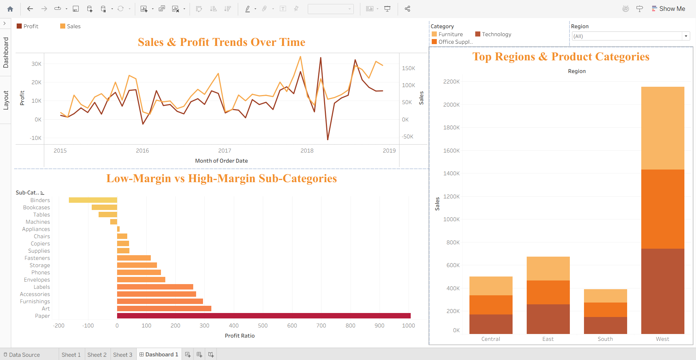

# Sales & Profit Performance Dashboard – Tableau

## 📖 Project Overview
This project demonstrates how to clean and prepare sales order data using **Tableau Prep**, and then build an interactive dashboard in **Tableau Desktop** to analyze sales and profit performance.

The goal was to enable business users to:
- Track sales & profit trends over time.
- Identify top-performing regions and product categories.
- Highlight low-margin or loss-making products and customers.
- Filter insights dynamically by region.

---

## 🛠 Tools Used
- **Tableau Prep** – for data cleaning, unions, and joins.
- **Tableau Desktop** – for building interactive dashboards.

---

## 📂 Repository Contents
| File Name                          | Description |
|------------------------------------|-------------|
| `Sales_Profit_Flow.tfl`            | Tableau Prep flow for cleaning, unions, and joins of the dataset. |
| `Sales_Profit_Dashboard.twbx`      | Packaged Tableau workbook containing the final dashboard. |
| `Sales_Profit_Dashboard_Screenshot.png` | Preview image of the dashboard for quick reference. |

---

## 📸 Dashboard Preview

---

## 🚀 How to Use
1. Open `Sales_Profit_Flow.tfl` in **Tableau Prep** to view the data preparation steps.  
2. Open `Sales_Profit_Dashboard.twbx` in **Tableau Desktop** to interact with the dashboard.  

---

## 📊 Key Insights
- Sales and profit fluctuated between 2015–2019.  
- The top-performing product category was **Paper**, while several categories showed losses.
- Top Regions & Product Categories: The **West region** outperformed all others, especially in **Technology** and **Furniture**. 
- Regional filter allows users to drill down into performance by geography.  
